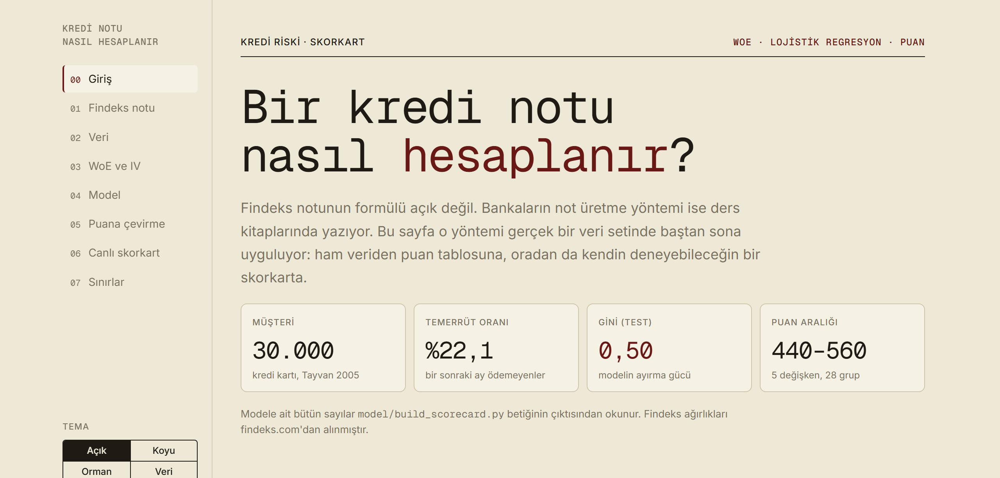
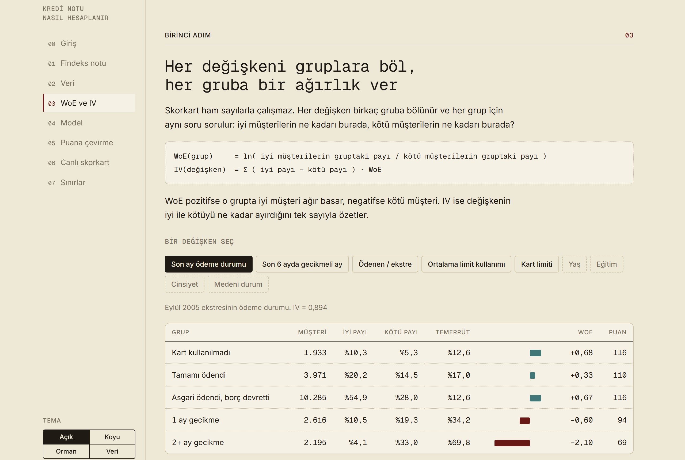
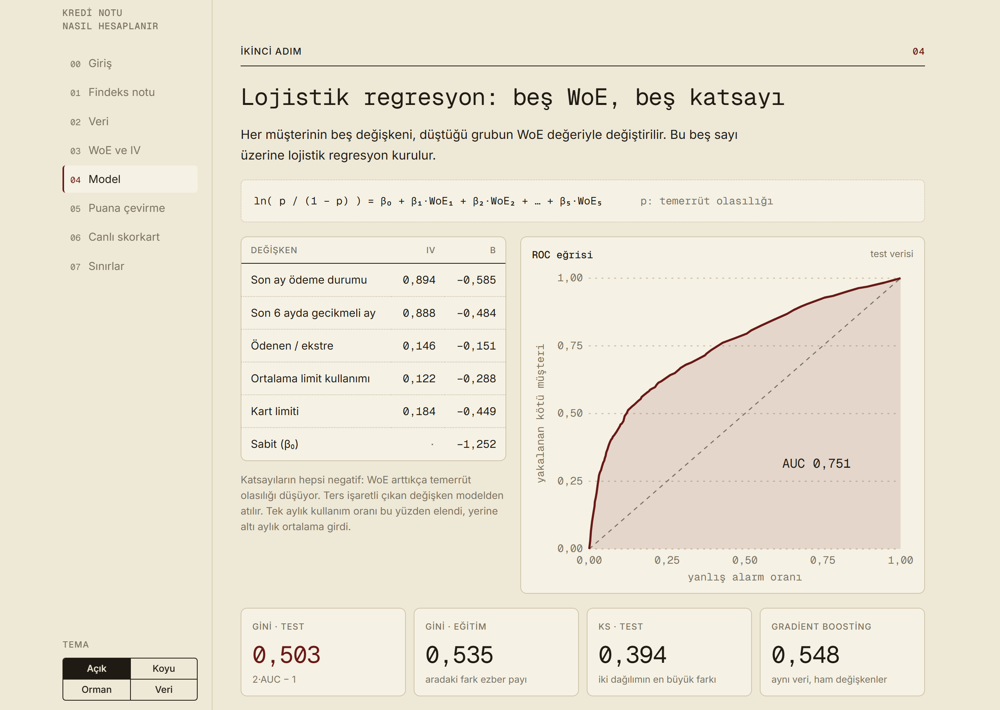
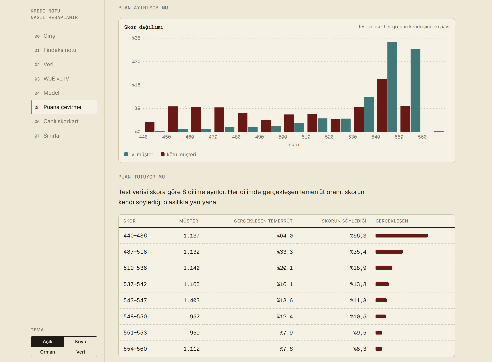
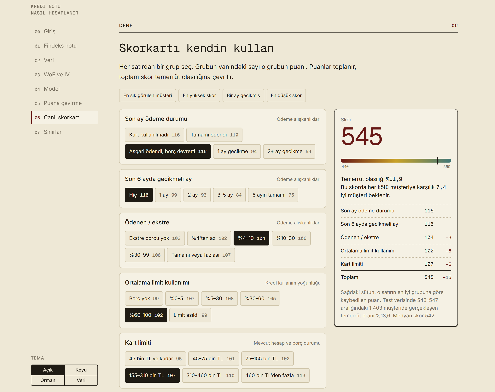

# Bir kredi notu nasıl hesaplanır?

Gerçek bir veri setinde baştan sona kredi skorkartı: WoE/IV ile gruplama, lojistik regresyon, puana çevirme ve tarayıcıda denenebilen canlı bir skorkart.

**[Siteyi aç → mcemdemirkol.github.io/kredi-notu-nasil-hesaplanir](https://mcemdemirkol.github.io/kredi-notu-nasil-hesaplanir/)**

[](https://mcemdemirkol.github.io/kredi-notu-nasil-hesaplanir/)

## Ne

Findeks notunun formülü kamuya açık değil; KKB yalnızca dört bileşenin ağırlığını yayımlıyor. Bankaların not üretme yöntemi ise standart: değişkenleri gruplara böl, her gruba bir ağırlık ver, lojistik regresyon kur, sonucu puana çevir. Bu repo o yöntemi 30.000 kredi kartı müşterisinin verisinde uygular ve her adımı sitede gösterir.

Bu skorkart **Findeks'in kopyası değildir** ve Türkiye'deki nota dair sayı vermez.

## Üç adım

### 1. Grupla, her gruba ağırlık ver

Her değişken 5–6 gruba bölünür. Bir grubun ağırlığı (WoE), iyi müşterilerin o gruptaki payının kötü müşterilerin payına oranının logaritmasıdır. IV, değişkenin iyi ile kötüyü ne kadar ayırdığını tek sayıyla özetler.



### 2. Lojistik regresyon kur

Beş değişkenin WoE değerleri üzerine lojistik regresyon. Katsayıların hepsi aynı işaretli; ters işaret veren değişken modelden çıkarıldı.



### 3. Puana çevir ve sına

`skor = offset + factor · ln(iyi/kötü)`. Ardından iki soru: puan iyi ile kötüyü ayırıyor mu, ve puanın söylediği olasılık gerçekleşenle tutuyor mu?



## Canlı skorkart

Her satırdan bir grup seçilir, puanlar toplanır, toplam skor temerrüt olasılığına çevrilir.

[](https://mcemdemirkol.github.io/kredi-notu-nasil-hesaplanir/#canli)

## Sonuçlar

| Ölçü | Değer |
|---|---|
| Müşteri | 30.000 (eğitim 21.000, test 9.000) |
| Temerrüt oranı | %22,1 |
| Gini (test) | 0,503 |
| Gini (eğitim) | 0,535 |
| KS (test) | 0,394 |
| Kıyas: gradient boosting, ham değişkenler (test Gini) | 0,548 |
| Puan aralığı | 440–560 |

Modeldeki beş değişken ve bilgi değerleri (IV):

| Değişken | IV |
|---|---|
| Son ay ödeme durumu | 0,894 |
| Son 6 ayda gecikmeli ay sayısı | 0,888 |
| Kart limiti | 0,184 |
| Ödenen tutar / ekstre | 0,146 |
| Ortalama limit kullanımı (6 ay) | 0,122 |

Cinsiyet, medeni durum, yaş ve eğitim modele alınmadı (IV 0,005–0,035).

## Çalıştırma

```bash
pip install -r requirements.txt
python model/build_scorecard.py
```

Betik `docs/scorecard.js` dosyasını yeniden üretir; sitedeki model sayıları bu dosyadan okunur. Siteyi yerelde görmek için `docs/index.html` dosyasını tarayıcıda açmak yeterli.

## Yapı

```
data/    UCI veri seti (xls) ve atıf
model/   build_scorecard.py — gruplama, WoE/IV, model, puan tablosu
docs/    index.html (site) ve scorecard.js (modelin çıktısı)
assets/  README görselleri
```

Site `gh-pages` dalından yayınlanır; bu dal `docs/` klasörünün kopyasıdır. Sitede değişiklik yapınca:

```bash
git subtree push --prefix docs origin gh-pages
```

## Yöntem

1. **Gruplama.** Her değişken elle çizilmiş 5–6 gruba bölünür.
2. **WoE / IV.** `WoE = ln(iyi payı / kötü payı)`, `IV = Σ (iyi payı − kötü payı) · WoE`. Yalnız eğitim verisinden hesaplanır.
3. **Model.** WoE değerleri üzerine lojistik regresyon. Ters işaretli katsayı veren değişken çıkarılır.
4. **Puan.** `skor = offset + factor · ln(iyi/kötü)`; 50:1 oranı 600 puan, her 20 puanda oran ikiye katlanır. Ölçek bir seçimdir; 440–560 aralığının Findeks'in 1–1900 aralığıyla ilgisi yoktur, aynı model başka bir PDO ile 1–1900'e de yayılabilir.
5. **Sınama.** Gini, KS, skor dağılımı ve skor bantlarında gerçekleşen temerrüt oranı test verisinde ölçülür.

## Sınırlar

- Veri 2005 Tayvan'ından, tek bankadan, tek üründen. Tutarlar Yeni Tayvan doları (NT$) cinsindendir; sitede kart limiti etiketleri 3 Ekim 2026 kuruyla (1 NT$ ≈ 1,54 TL) TL'ye çevrilmiştir, bu bir alım gücü eşitlemesi değildir.
- Yalnız kabul edilmiş müşteriler var; reddedilen başvurular için düzeltme yapılmadı.
- Tek dönem; sonraki aylarda sınama yok.
- Gruplar elle çizildi, sıralı risk zorlanmadı.
- Limit değişkeni bankanın önceki kararını taşır.

## Veri ve atıf

Yeh, I-C. (2009). *Default of Credit Card Clients* [veri seti]. UCI Machine Learning Repository. https://doi.org/10.24432/C55S3H — CC BY 4.0.

Yeh, I-C. ve Lien, C-H. (2009). The comparisons of data mining techniques for the predictive accuracy of probability of default of credit card clients. *Expert Systems with Applications*, 36(2), 2473–2480.

Findeks bileşen ağırlıkları: [findeks.com](https://www.findeks.com/urunler/findeks-kredi-notu), erişim 3 Ekim 2026.

## English summary

An end-to-end credit scorecard on the UCI "Default of Credit Card Clients" data: manual binning, WoE/IV, logistic regression on WoE, points scaling (600 at 50:1 odds, PDO 20), and an interactive scorecard page. Test Gini 0.503 against 0.548 for a gradient boosting benchmark on raw features. The page is in Turkish; run `python model/build_scorecard.py` to regenerate every model number it shows.
